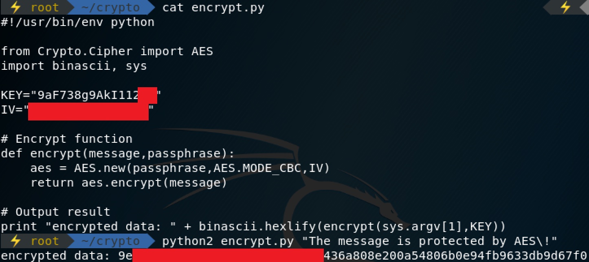
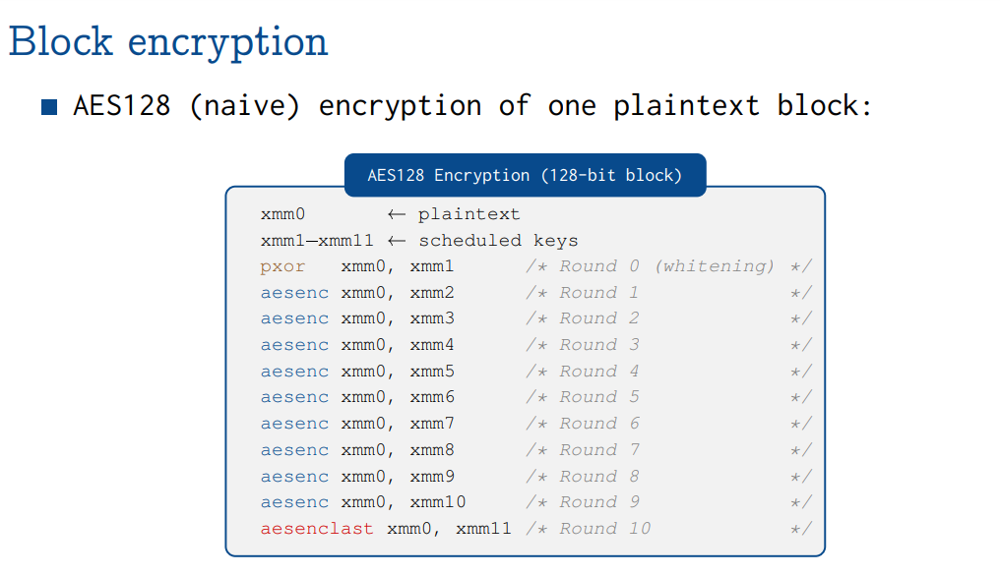

# Forensics
## Burn the candle on both ends
一張jpg圖片，用binwalk檢查一下發現藏有一個zip文件是對flag.txt的壓縮。提取zip文件後，發現需要解壓密碼。

因爲題目描述說需要從兩端燃燒蠟燭，誤以爲密碼是藏在了圖片中，怎麼也找不到，比賽時止步於此。賽後看別人的writeup，發現是爆破的。。。

於是：
1. binwalk -e candle.jpg
2. zip2john 1944.zip > 1944.hashes
3. john 1944.hashes --wordlist rockyou.txt

解壓得到flag。

## Bucket 'o cash
給出鏈接`https://s3.amazonaws.com/ritsec-ctf-files/memorydump`可下載一個256M的memorydump文件，提出提示爲CentOS 7.5。

1. 用strings提取字符串，看到以下有趣的東西：
    ```
    overflow is detected
    grub rescure
    Linux 3.10.0-862.el7.x86_64 uhci_hcd
    WMware
    .text
    .rodata
    .bss
    .symtab
    x86_64-redhat-linux-gnu
    ELF 64-bit LSB executable, x86-64, version 1 (SYSV), dynamically linked (uses shared libs), for GNU/Linux 2.6.32, BuildID[sha1]=630a050ff5721c66963b0a666b55a7b63175621b, stripped
    mv flag /home/memes/
    ./flag
    cp flag.c /home/memes/
    ```
    雖然信息很多，然而感覺無從下手。
2. 用binwalk分析，看到很多linux路徑輸出。但也沒什麼具體頭緒。
3. 用volatility分析，imageinfo沒有給出推薦結果，pslist、dumpfiles也都無法正常進行。

再次止步，等學了writeup後補充。

暈，看了writeup，離成功其實也不算遠，strings裏面我們感興趣的差不多就是後面volatility的分析指南。雖然volatility的imageinfo沒有給出結果，但是題目其實給了，而且strings裏面也能看出（`Linux 3.10.0-862.el7.x86_64 uhci_hcd`，Google知道爲CentOS 7.x），然後就是對volatility的熟練使用問題了。

1. volatility需要下載相應OS的profile才能有效工作，默認只只帶了Windows的（可以通過`volatility --info | grep Profile`查看）。Google搜索“volatility CentOS profile”，發現Github上就有，[下載](https://github.com/volatilityfoundation/profiles/blob/master/Linux/CentOS/x86/centos7-7.5.1804/Centos7-3.10.0-862.el7.x86_64.zip)放置與`/usr/lib/python2.7/dist-packages/volatility/plugins/overlays/linux`目錄下。
1. 驗證安裝Profile成功。
    ```bash
    $ volatility --info| grep Profile | grep Linux
    Volatility Foundation Volatility Framework 2.6
    LinuxCentos7-3_10_0-862_el7_x86_64x64 - A Profile for Linux Centos7-3.10.0-862.el7.x86_64 x64
    ```
1. 檢查一下進程情況。
    ```bash
    $ volatility -f memorydump --profile=LinuxCentos7-3_10_0-862_el7_x86_64x64 linux_psaux
    Volatility Foundation Volatility Framework 2.6
    Pid    Uid    Gid    Arguments
    1      0      0      /usr/lib/systemd/systemd --switched-root --system --deserialize 22
    2      0      0      [kthreadd]
    3      0      0      [ksoftirqd/0]
    5      0      0      [kworker/0:0H]
    6      0      0      [kworker/u256:0]
    7      0      0      [migration/0]
    8      0      0      [rcu_bh]
    9      0      0      [rcu_sched]
    10     0      0      [lru-add-drain]
    11     0      0      [watchdog/0]
    13     0      0      [kdevtmpfs]
    14     0      0      [netns]
    15     0      0      [khungtaskd]
    16     0      0      [writeback]
    17     0      0      [kintegrityd]
    18     0      0      [bioset]
    19     0      0      [kblockd]
    20     0      0      [md]
    21     0      0      [edac-poller]
    22     0      0      [kworker/0:1]
    27     0      0      [kswapd0]
    28     0      0      [ksmd]
    29     0      0      [crypto]
    37     0      0      [kthrotld]
    39     0      0      [kmpath_rdacd]
    40     0      0      [kaluad]
    41     0      0      [kpsmoused]
    43     0      0      [ipv6_addrconf]
    56     0      0      [deferwq]
    87     0      0      [kauditd]
    264    0      0      [mpt_poll_0]
    265    0      0      [mpt/0]
    266    0      0      [ata_sff]
    274    0      0      [scsi_eh_0]
    275    0      0      [scsi_tmf_0]
    276    0      0      [scsi_eh_1]
    279    0      0      [scsi_tmf_1]
    281    0      0      [scsi_eh_2]
    282    0      0      [scsi_tmf_2]
    285    0      0      [ttm_swap]
    287    0      0      [irq/16-vmwgfx]
    358    0      0      [kdmflush]
    359    0      0      [bioset]
    369    0      0      [kdmflush]
    370    0      0      [bioset]
    382    0      0      [bioset]
    383    0      0      [xfsalloc]
    384    0      0      [xfs_mru_cache]
    385    0      0      [xfs-buf/dm-0]
    386    0      0      [xfs-data/dm-0]
    387    0      0      [xfs-conv/dm-0]
    388    0      0      [xfs-cil/dm-0]
    389    0      0      [xfs-reclaim/dm-]
    390    0      0      [xfs-log/dm-0]
    391    0      0      [xfs-eofblocks/d]
    392    0      0      [xfsaild/dm-0]
    393    0      0      [kworker/0:1H]
    459    0      0      /usr/lib/systemd/systemd-journald
    481    0      0
    482    0      0
    506    0      0      [nfit]
    530    0      0      [xfs-buf/sda1]
    531    0      0      [xfs-data/sda1]
    532    0      0      [xfs-conv/sda1]
    533    0      0      [xfs-cil/sda1]
    535    0      0      [xfs-reclaim/sda]
    538    0      0      [xfs-log/sda1]
    541    0      0      [xfs-eofblocks/s]
    543    0      0      [xfsaild/sda1]
    599    0      0
    626    999    998
    628    0      0      /usr/lib/systemd/systemd-logind
    630    81     81     /usr/bin/dbus-daemon --system --address=systemd: --nofork --nopidfile --systemd-activation
    636    998    996    /usr/sbin/chronyd
    647    0      0      /usr/sbin/crond -n
    652    0      1000
    656    0      0
    657    0      0      /usr/sbin/NetworkManager --no-daemon
    992    0      0
    993    0      0
    994    0      0
    1128   0      0
    1140   89     89
    1263   1000   1000
    1284   0      0
    1288   0      0
    1329   89     89     pickup -l -t unix -u
    1337   0      0
    1339   0      0      tmux
    1340   0      0      -bash
    1355   0      0      -bash
    1370   0      0
    1484   0      0      [kworker/u256:1]
    13153  0      0      /sbin/dhclient -d -q -sf /usr/libexec/nm-dhcp-helper -pf /var/run/dhclient-ens33.pid -lf /var/lib/NetworkManager/dhclient-5d98076d-95e2-4700-9cdd-fab7301cf613-ens33.lease -cf /var/lib/NetworkManager/dhclient-ens33.conf ens33
    13476  0      0      [kworker/0:2]
    13480  0      0      /sbin/agetty --noclear tty2 linux
    13481  0      0      /sbin/agetty --noclear tty3 linux
    13488  0      0      [kworker/0:0]
    13498  0      0      ./flag
    13500  0      0
    ```
    ./flag赫然在列。
1. 將該進程dump出來：
    ```bash
    $ volatility -f memorydump --profile=LinuxCentos7-3_10_0-862_el7_x86_64x64 linux_procdump --pid 13498 -D .
    Volatility Foundation Volatility Framework 2.6
    Offset             Name                 Pid             Address            Output File
    ------------------ -------------------- --------------- ------------------ -----------
    0xffff8ed8402cbf40 flag                 13498           0x0000000000400000 ./flag.13498.0x400000
    ```
1. 單獨分析這個文件：
    ```bash
    $ strings flag.13498.0x400000
    /lib64/ld-linux-x86-64.so.2
    libc.so.6
    puts
    __libc_start_main
    __gmon_start__
    GLIBC_2.2.5
    UklUU0VDH
    e00zbTByH
    D$ Cg==H
    eV9GMHIzH
    bnMxY3N9H
    D$27
    UH-0
    UH-0
    []A\A]A^A_
    ;*3$"
    /lib64/ld-linux-x86-64.so.2
    libc.so.6
    puts
    __libc_start_main
    __gmon_start__
    GLIBC_2.2.5
    UklUU0VDH
    e00zbTByH
    D$ Cg==H
    eV9GMHIzH
    bnMxY3N9H
    D$27
    UH-0
    UH-0
    []A\A]A^A_
    ;*3$"
    ```
1. 其中H結尾的幾個字符串很像base64編碼。
    ```bash
    $ strings flag.13498.0x400000 | grep H$ | base64 -d
    RITSEC�4ʹ��pbase64: invalid input
    ```
1. 看來很接近了，有==的那一行應該在最後一行，先看看前面：
    ```bash
    $ strings flag.13498.0x400000 | grep H$ | head -5 | sed -e 's/H$//' -e '/^D/d'| base64 -d
    RITSEC{M3m0ry_F0r3ns1cs}
    ```
看來不用==就好。如果覺得這個方法有些撞運氣，寫個腳本爆破好啦。

其實Cg==可以用也可以不用(以爲最後這個是個回車)：
```bash
$ echo 'RITSEC{M3m0ry_F0r3ns1cs}' | base64
UklUU0VDe00zbTByeV9GMHIzbnMxY3N9Cg==
$ echo 'UklUU0VDe00zbTByeV9GMHIzbnMxY3N9' | base64 -d
RITSEC{M3m0ry_F0r3ns1cs}$ echo 'UklUU0VDe00zbTByeV9GMHIzbnMxY3N9Cg==' | base64
RITSEC{M3m0ry_F0r3ns1cs}
```

1. [參考Writeup](https://github.com/flawwan/CTF-Writeups/blob/master/ritsec/bucketofcash/writeup.md)

## PCAP Me If You Can
根據題目描述，這應該是實現了一個私有協議。既然是私有協議，先看有沒有可以端口：
```bash
$ tshark -r *.pcapng -Tfields -e tcp.port | sort | uniq
22,33468
22,50644
33468,22
33758,443
34414,443
34416,443
...
80,57110
80,57122
80,57144
80,58646
8888,45826
8888,45828
8888,45830
8888,45832
8888,45838
8888,45852
8888,45854
8888,46062
8888,46078
8888,46114
```
8888端口顯然很可疑。提取會話：
```bash
$ tshark -r *.pcapng tcp.port==8888| sort| uniq | grep Len
13990  68.058515 172.16.140.131 → 172.16.140.1 TCP 74 45826 → 8888 [SYN] Seq=0 Win=29200 Len=0 MSS=1460 SACK_PERM=1 TSval=2111755176 TSecr=0 WS=128
13991  68.058661 172.16.140.1 → 172.16.140.131 TCP 78 8888 → 45826 [SYN, ACK] Seq=0 Ack=1 Win=65535 Len=0 MSS=1460 WS=32 TSval=676410590 TSecr=2111755176 SACK_PERM=1
13992  68.058814 172.16.140.131 → 172.16.140.1 TCP 66 45826 → 8888 [ACK] Seq=1 Ack=1 Win=29312 Len=0 TSval=2111755177 TSecr=676410590
13993  68.058874 172.16.140.1 → 172.16.140.131 TCP 66 [TCP Window Update] 8888 → 45826 [ACK] Seq=1 Ack=1 Win=131744 Len=0 TSval=676410591 TSecr=2111755177
13994  68.058952 172.16.140.131 → 172.16.140.1 TCP 112 45826 → 8888 [PSH, ACK] Seq=1 Ack=1 Win=29312 Len=46 TSval=2111755177 TSecr=676410590
13995  68.059025 172.16.140.1 → 172.16.140.131 TCP 66 8888 → 45826 [ACK] Seq=1 Ack=47 Win=131712 Len=0 TSval=676410591 TSecr=2111755177
13998  68.071416 172.16.140.1 → 172.16.140.131 TCP 74 8888 → 45826 [PSH, ACK] Seq=1 Ack=47 Win=131712 Len=8 TSval=676410603 TSecr=2111755177
13999  68.071475 172.16.140.1 → 172.16.140.131 TCP 66 8888 → 45826 [FIN, ACK] Seq=9 Ack=47 Win=131712 Len=0 TSval=676410603 TSecr=2111755177
14000  68.071634 172.16.140.131 → 172.16.140.1 TCP 66 45826 → 8888 [ACK] Seq=47 Ack=9 Win=29312 Len=0 TSval=2111755190 TSecr=676410603
14001  68.071832 172.16.140.131 → 172.16.140.1 TCP 66 45826 → 8888 [FIN, ACK] Seq=47 Ack=10 Win=29312 Len=0 TSval=2111755190 TSecr=676410603
14002  68.071904 172.16.140.1 → 172.16.140.131 TCP 66 8888 → 45826 [ACK] Seq=10 Ack=48 Win=131712 Len=0 TSval=676410603 TSecr=2111755190
14138  79.466505 172.16.140.131 → 172.16.140.1 TCP 74 45828 → 8888 [SYN] Seq=0 Win=29200 Len=0 MSS=1460 SACK_PERM=1 TSval=2111766584 TSecr=0 WS=128
14139  79.466630 172.16.140.1 → 172.16.140.131 TCP 78 8888 → 45828 [SYN, ACK] Seq=0 Ack=1 Win=65535 Len=0 MSS=1460 WS=32 TSval=676421949 TSecr=2111766584 SACK_PERM=1
14140  79.466742 172.16.140.131 → 172.16.140.1 TCP 66 45828 → 8888 [ACK] Seq=1 Ack=1 Win=29312 Len=0 TSval=2111766585 TSecr=676421949
14141  79.466801 172.16.140.1 → 172.16.140.131 TCP 66 [TCP Window Update] 8888 → 45828 [ACK] Seq=1 Ack=1 Win=131744 Len=0 TSval=676421950 TSecr=2111766585
14142  79.466844 172.16.140.131 → 172.16.140.1 TCP 117 45828 → 8888 [PSH, ACK] Seq=1 Ack=1 Win=29312 Len=51 TSval=2111766585 TSecr=676421949
```

有數據傳輸的是Len!=0的那些(tcp.len != 0)。
```bash
$ tshark -r *.pcapng -T fields -e tcp.port -e data tcp.port==8888 and tcp.len!=0
45826,8888	566572622e5245414400eee3ecf2dface5edece300afb1b1b5e6dff6edf0f1d0e1aeaeea00adf2ebeeadedf3f200
8888,45826	c3d0d0cdd09e1337
45828,8888	566572622e575249544500eee3ecf2dface5edece300afb1b1b5e6dff6edf0f1d0e1aeaeea00a0f5e3eaea9ee6edf5e2f7a000
8888,45828	f5e3eaea9ee6edf5e2f79eadf2ebeeadedf3f2881337
45830,8888	566572622e5245414400eee3ecf2dface5edece300afb1b1b5e6dff6edf0f1d0e1aeaeea00adf2ebeeadedf3f200
8888,45830	c3d0d0cdd09e1337
45832,8888	566572622e575249544500eee3ecf2dface5edece300afb1b1b5e6dff6edf0f1d0e1aeaeea00cdcbc59ee6edf59edff0e39ef7edf3bd00
8888,45832	cdcbc59ee6edf59edff0e39ef7edf3bd9eadf2ebeeadedf3f2881337
45838,8888	566572622e5245414400eee3ecf2dface5edece300afb1b1b5e6dff6edf0f1d0e1aeaeea00adf2ebeeadedf3f200
8888,45838	cdcbc59ee6edf59edff0e39ef7edf3bd9e881337
45852,8888	566572622e5245414400eee3ecf2dface5edece300afb1b1b5e6dff6edf0f1d0e1aeaeea00f5e6eddfebe700
8888,45852	c3d0d0cdd09e1337
45854,8888	566572622e5245414400eee3ecf2dface5edece300afb1b1b5e6dff6edf0f1d0e1aeaeea00adf2ebeeadedf3f2b99ef5e6eddfebe700
8888,45854	cdcbc59ee6edf59edff0e39ef7edf3bd9e88e6f3eaf2ed881337
46062,8888	566572622e5245414400eee3ecf2dface5edece300afb1b1b5e6dff6edf0f1d0e1aeaeea00adf2ebeeade2dff2df00
8888,46062	d0c7d2d1c3c1f9d2e6aff1dde7f1ddcbf7ddcedfb3f1f5aef0e2ddd2e6b1f0e3dddff0e3ddcbdfecf7ddeae7e9e3dde7f2dde0f3b5ddf2e6e7b3ddafdde7f1ddebe7ece3fb881337
46078,8888	566572622e575249544500eee3ecf2dface5edece300afb1b1b5e6dff6edf0f1d0e1aeaeea00f7aeeaae9eebdfec00
8888,46078	f7aeeaae9eebdfec9eadf2ebeeadedf3f2881337
46114,8888	566572622e5245414400eee3ecf2dface5edece300afb1b1b5e6dff6edf0f1d0e1aeaeea00adf2ebeeadedf3f200
8888,46114	f7aeeaae9eebdfec881337
```
可以看出服務器和客戶端之間一問一答還是蠻有規律的，而且客戶端的消息中前面的部分（第一個以C字符串）好像都是可打印字符，不妨驗證一下：

```bash
$ tshark -r *.pcapng -T fields -e data tcp.dstport==8888 and tcp.len!=0 | decode.py hex
b'Verb.READ\x00\xee\xe3\xec\xf2\xdf\xac\xe5\xed\xec\xe3\x00\xaf\xb1\xb1\xb5\xe6\xdf\xf6\xed\xf0\xf1\xd0\xe1\xae\xae\xea\x00\xad\xf2\xeb\xee\xad\xed\xf3\xf2\x00'
b'Verb.WRITE\x00\xee\xe3\xec\xf2\xdf\xac\xe5\xed\xec\xe3\x00\xaf\xb1\xb1\xb5\xe6\xdf\xf6\xed\xf0\xf1\xd0\xe1\xae\xae\xea\x00\xa0\xf5\xe3\xea\xea\x9e\xe6\xed\xf5\xe2\xf7\xa0\x00'
b'Verb.READ\x00\xee\xe3\xec\xf2\xdf\xac\xe5\xed\xec\xe3\x00\xaf\xb1\xb1\xb5\xe6\xdf\xf6\xed\xf0\xf1\xd0\xe1\xae\xae\xea\x00\xad\xf2\xeb\xee\xad\xed\xf3\xf2\x00'
b'Verb.WRITE\x00\xee\xe3\xec\xf2\xdf\xac\xe5\xed\xec\xe3\x00\xaf\xb1\xb1\xb5\xe6\xdf\xf6\xed\xf0\xf1\xd0\xe1\xae\xae\xea\x00\xcd\xcb\xc5\x9e\xe6\xed\xf5\x9e\xdf\xf0\xe3\x9e\xf7\xed\xf3\xbd\x00'
b'Verb.READ\x00\xee\xe3\xec\xf2\xdf\xac\xe5\xed\xec\xe3\x00\xaf\xb1\xb1\xb5\xe6\xdf\xf6\xed\xf0\xf1\xd0\xe1\xae\xae\xea\x00\xad\xf2\xeb\xee\xad\xed\xf3\xf2\x00'
b'Verb.READ\x00\xee\xe3\xec\xf2\xdf\xac\xe5\xed\xec\xe3\x00\xaf\xb1\xb1\xb5\xe6\xdf\xf6\xed\xf0\xf1\xd0\xe1\xae\xae\xea\x00\xf5\xe6\xed\xdf\xeb\xe7\x00'
b'Verb.READ\x00\xee\xe3\xec\xf2\xdf\xac\xe5\xed\xec\xe3\x00\xaf\xb1\xb1\xb5\xe6\xdf\xf6\xed\xf0\xf1\xd0\xe1\xae\xae\xea\x00\xad\xf2\xeb\xee\xad\xed\xf3\xf2\xb9\x9e\xf5\xe6\xed\xdf\xeb\xe7\x00'
b'Verb.READ\x00\xee\xe3\xec\xf2\xdf\xac\xe5\xed\xec\xe3\x00\xaf\xb1\xb1\xb5\xe6\xdf\xf6\xed\xf0\xf1\xd0\xe1\xae\xae\xea\x00\xad\xf2\xeb\xee\xad\xe2\xdf\xf2\xdf\x00'
b'Verb.WRITE\x00\xee\xe3\xec\xf2\xdf\xac\xe5\xed\xec\xe3\x00\xaf\xb1\xb1\xb5\xe6\xdf\xf6\xed\xf0\xf1\xd0\xe1\xae\xae\xea\x00\xf7\xae\xea\xae\x9e\xeb\xdf\xec\x00'
b'Verb.READ\x00\xee\xe3\xec\xf2\xdf\xac\xe5\xed\xec\xe3\x00\xaf\xb1\xb1\xb5\xe6\xdf\xf6\xed\xf0\xf1\xd0\xe1\xae\xae\xea\x00\xad\xf2\xeb\xee\xad\xed\xf3\xf2\x00'
```
不錯，看到了希望。進一步看出，客戶端的每一則消息都是由四個C字符串組成的，第一個字符串只有兩種指令：Verb.READ和Verb.WRITE，第二個和第三個字符串只有一種固定模式，最後一個字符串各不相同：
```bash
$ tshark -r *.pcapng -T fields -e data tcp.dstport==8888 and tcp.len!=0 | decode.py hex | sed -e 's/^..//' -e 's/.$//' -e 's/\\x00/\t/g' -e 's/\\x//g'
Verb.READ	eee3ecf2dface5edece3	afb1b1b5e6dff6edf0f1d0e1aeaeea	adf2ebeeadedf3f2
Verb.WRITE	eee3ecf2dface5edece3	afb1b1b5e6dff6edf0f1d0e1aeaeea	a0f5e3eaea9ee6edf5e2f7a0
Verb.READ	eee3ecf2dface5edece3	afb1b1b5e6dff6edf0f1d0e1aeaeea	adf2ebeeadedf3f2
Verb.WRITE	eee3ecf2dface5edece3	afb1b1b5e6dff6edf0f1d0e1aeaeea	cdcbc59ee6edf59edff0e39ef7edf3bd
Verb.READ	eee3ecf2dface5edece3	afb1b1b5e6dff6edf0f1d0e1aeaeea	adf2ebeeadedf3f2
Verb.READ	eee3ecf2dface5edece3	afb1b1b5e6dff6edf0f1d0e1aeaeea	f5e6eddfebe7
Verb.READ	eee3ecf2dface5edece3	afb1b1b5e6dff6edf0f1d0e1aeaeea	adf2ebeeadedf3f2b99ef5e6eddfebe7
Verb.READ	eee3ecf2dface5edece3	afb1b1b5e6dff6edf0f1d0e1aeaeea	adf2ebeeade2dff2df
Verb.WRITE	eee3ecf2dface5edece3	afb1b1b5e6dff6edf0f1d0e1aeaeea	f7aeeaae9eebdfec
Verb.READ	eee3ecf2dface5edece3	afb1b1b5e6dff6edf0f1d0e1aeaeea	adf2ebeeadedf3f2
```
服務器端的消息也很有意思，全部以十六進制1377結尾：
```bash
$ tshark -r *.pcapng -T fields -e data tcp.srcport==8888 and tcp.len!=0
c3d0d0cdd09e1337
f5e3eaea9ee6edf5e2f79eadf2ebeeadedf3f2881337
c3d0d0cdd09e1337
cdcbc59ee6edf59edff0e39ef7edf3bd9eadf2ebeeadedf3f2881337
cdcbc59ee6edf59edff0e39ef7edf3bd9e881337
c3d0d0cdd09e1337
cdcbc59ee6edf59edff0e39ef7edf3bd9e88e6f3eaf2ed881337
d0c7d2d1c3c1f9d2e6aff1dde7f1ddcbf7ddcedfb3f1f5aef0e2ddd2e6b1f0e3dddff0e3ddcbdfecf7ddeae7e9e3dde7f2dde0f3b5ddf2e6e7b3ddafdde7f1ddebe7ece3fb881337
f7aeeaae9eebdfec9eadf2ebeeadedf3f2881337
f7aeeaae9eebdfec881337
```
將多餘信息去掉，再次顯示通信過程，特徵將更加明顯：
```bash
$ tshark -r *.pcapng -T fields -e data tcp.port==8888 and tcp.len!=0 | decode.py hex | sed -e 's/^..//' -e 's/.$//' -e 's/\\x00/\t/g' | awk '{print $1, $4}' | encode.py hex | sed -e 's/566572622e5245414420/R /' -e 's/566572622e575249544520/W /'
R adf2ebeeadedf3f2
c3d0d0cdd09e1337
W a0f5e3eaea9ee6edf5e2f7a0
f5e3eaea9ee6edf5e2f79eadf2ebeeadedf3f2881337
R adf2ebeeadedf3f2
c3d0d0cdd09e1337
W cdcbc59ee6edf59edff0e39ef7edf3bd
cdcbc59ee6edf59edff0e39ef7edf3bd9eadf2ebeeadedf3f2881337
R adf2ebeeadedf3f2
cdcbc59ee6edf59edff0e39ef7edf3bd9e881337
R f5e6eddfebe7
c3d0d0cdd09e1337
R adf2ebeeadedf3f2b99ef5e6eddfebe7
cdcbc59ee6edf59edff0e39ef7edf3bd9e88e6f3eaf2ed881337
R adf2ebeeade2dff2df
d0c7d2d1c3c1f9d2e6aff1dde7f1ddcbf7ddcedfb3f1f5aef0e2ddd2e6b1f0e3dddff0e3ddcbdfecf7ddeae7e9e3dde7f2dde0f3b5ddf2e6e7b3ddafdde7f1ddebe7ece3fb881337
W f7aeeaae9eebdfec
f7aeeaae9eebdfec9eadf2ebeeadedf3f2881337
R adf2ebeeadedf3f2
f7aeeaae9eebdfec881337
```
在編輯器中稍作整理：
```bash
R                                       adf2ebeeadedf3f2
c3d0d0cdd0                          9e                      1337
-----------------------------------------------------------------------------------------------------------------------
W a0 f5e3eaea9ee6edf5e2f7 a0
     f5e3eaea9ee6edf5e2f7           9e  adf2ebeeadedf3f2 88 1337
-----------------------------------------------------------------------------------------------------------------------
R                                       adf2ebeeadedf3f2
c3d0d0cdd0                          9e                      1337
-----------------------------------------------------------------------------------------------------------------------
W cdcbc59ee6edf59edff0e39ef7edf3bd
  cdcbc59ee6edf59edff0e39ef7edf3bd  9e  adf2ebeeadedf3f2 88 1337
-----------------------------------------------------------------------------------------------------------------------
R                                       adf2ebeeadedf3f2
  cdcbc59ee6edf59edff0e39ef7edf3bd  9e                   88 1337
-----------------------------------------------------------------------------------------------------------------------
R                                                                             f5e6eddfebe7
c3d0d0cdd0                          9e                      1337
-----------------------------------------------------------------------------------------------------------------------
R                                       adf2ebeeadedf3f2            b9  9e    f5e6eddfebe7
  cdcbc59ee6edf59edff0e39ef7edf3bd  9e  88e6f3eaf2ed     88 1337
-----------------------------------------------------------------------------------------------------------------------
R                                       adf2ebeeade2dff2df
d0c7d2d1c3c1f9d2e6aff1dde7f1ddcbf7ddcedfb3f1f5aef0e2ddd2e6b1f0e3dddff0e3ddcbdfecf7ddeae7e9e3dde7f2dde0f3b5ddf2e6e7b3ddafdde7f1ddebe7ece3fb 88 1337
-----------------------------------------------------------------------------------------------------------------------

W f7aeeaae9eebdfec
  f7aeeaae9eebdfec                  9e  adf2ebeeadedf3f2 88 1337
-----------------------------------------------------------------------------------------------------------------------
R                                       adf2ebeeadedf3f2
  f7aeeaae9eebdfec                                       88 1337
```
注意到在R的應答中，有三條都是相同的'c3d0d0cdd0'（9e好像是某種消息的結束符，88是另外某種信息的結束符，1337是整個消息結束符），感覺像是某種狀態指示。常見狀態如OK、ERROR、SUCCESS，注意到其中很扎眼的三個'd0'，猜測應該是error或者ERROR。
```bash
cipher: c3 d0 d0 cd d0
string: E  R  R  O  R
ord(x): 45 52 52 4f 52
```
注意到c3-45=d0-52=cd-4f=7e。（如果是error，則差值爲0x5e）
```python
#!/usr/bin/python3
# -*- coding=utf8 -*-
with open('data.txt') as f:
    for line in f.readlines():
        line = line.strip()
        s = ''
        for i in range(0, len(line), 2):
            c = line[i:i+2]
            if c == '00':
                s += ' '
            else:
                s += chr(int(c, base=16) - 0x7e)
        print(s)
```
```bash
$ tshark -r *.pcapng -T fields -e data tcp.port==8888 and tcp.len!=0 | sed -e 's/566572622e5245414400//' -e 's/566572622e575249544500//' -e 's/1337$//' > data.txt
$ ./a.py
penta.gone 1337haxorsRc00l /tmp/out
ERROR
penta.gone 1337haxorsRc00l "well howdy"
well howdy /tmp/out

penta.gone 1337haxorsRc00l /tmp/out
ERROR
penta.gone 1337haxorsRc00l OMG how are you?
OMG how are you? /tmp/out

penta.gone 1337haxorsRc00l /tmp/out
OMG how are you?

penta.gone 1337haxorsRc00l whoami
ERROR
penta.gone 1337haxorsRc00l /tmp/out; whoami
OMG how are you?
hulto

penta.gone 1337haxorsRc00l /tmp/data
RITSEC{Th1s_is_My_Pa5sw0rd_Th3re_are_Many_like_it_bu7_thi5_1_is_mine}

penta.gone 1337haxorsRc00l y0l0 man
y0l0 man /tmp/out

penta.gone 1337haxorsRc00l /tmp/out
y0l0 man
```
得到flag（如果用error版本，輸出不全是可打印字符且類似亂碼）。

也可以通過猜測d0c7d2d1c3c1是RITSEC來得到同樣的結論，這是參考Writeup中的方法。

1. [參考Writeup](https://fireshellsecurity.team/ritsec-pcap-me-if-you-can/)

## From our friends at nexthop!
1. 大概瀏覽一下pcap文件，發現有個域名就叫nexthop，很大可能就是它了：
    ```bash
    $ tshark -r nexthop.pcap | grep nexthop
        3 108468.003977 192.168.1.174 → 192.168.1.1  DNS 75 Standard query 0x9c95 A nexthop.network
        4 108468.003977 192.168.1.174 → 192.168.1.1  DNS 75 Standard query 0x9c95 A nexthop.network
        9 108468.003977 192.168.1.174 → 192.168.1.1  DNS 75 Standard query 0x9c95 A nexthop.network
       10 108468.003977 192.168.1.174 → 192.168.1.1  DNS 75 Standard query 0x9c95 A nexthop.network
       31 108468.003977 192.168.1.174 → 192.168.1.1  DNS 75 Standard query 0x9c95 A nexthop.network
       ...
    ```
2. 上一條命令後接wc查看一下，一共有144條。看起來應該是相同的DNS查詢請求。再仔細查看一下：
    ```bash
    $ tshark -r nexthop.pcap | grep nexthop| wc
        144    1728   14112
    $ tshark -r nexthop.pcap ip.dst==192.168.1.1 | wc
        144    1728   14112
    $ tshark -r nexthop.pcap -T fields -e data --disable-protocol dns ip.dst==192.168.1.1
    9c9501000001000000000000076e657874686f70076e6574776f726b0000010000
    9c9501000001000000000000076e657874686f70076e6574776f726b0000010001
    9c9501000001000000000000076e657874686f70076e6574776f726b0000010000
    9c9501000001000000000000076e657874686f70076e6574776f726b0000010001
    9c9501000001000000000000076e657874686f70076e6574776f726b0000010000
    9c9501000001000000000000076e657874686f70076e6574776f726b0000010000
    ...
    $ tshark -r nexthop.pcap -T fields -e data --disable-protocol dns ip.dst==192.168.1.1 | sort | uniq
    9c9501000001000000000000076e657874686f70076e6574776f726b0000010000
    9c9501000001000000000000076e657874686f70076e6574776f726b0000010001
    ```
    明明應該是相同的數據，卻出現了兩種不同的模式，最後一個比特不同。提取出來：
    ```bash
    $ tshark -r nexthop.pcap -T fields -e data --disable-protocol dns ip.dst==192.168.1.1 | sed -r 's/.*(.)$/\1/g' | xargs | sed 's/ //g'
    010100100101001101111011001100010101010000110101010111110011010001001100010101110011010001011001001101010101111101000100010011100011010101111101
    $ tshark -r nexthop.pcap -T fields -e data --disable-protocol dns ip.dst==192.168.1.1 | sed -r 's/.*(.)$/\1/g' | xargs | sed 's/ //g' | wc
          1       1     145
    ```
    共144個字符（最後一個是回車）。假設是二進制ascii編碼，於是每個字節8個比特，共144/8=18個字符。
    ```bash
    $ tshark -r nexthop.pcap -T fields -e data --disable-protocol dns ip.dst==192.168.1.1 | sed -r 's/.*(.)$/\1/g' | xargs | sed 's/ //g' | decode.py bin
    b'RS{1T5_4LW4Y5_DN5}'
    ```
    得到了flag。

## Lite Forensics
給了一堆sql命令，說flag就在數據庫中。

[此處](https://ctftime.org/writeup/12223)給了一個writeup，但是沒看懂。

# Misc
## Patch Patch
題目給出一個rpm文件和一個文本文件。文本文件指出在patch.c的fatal_exit函數中刪除了三行代碼：
```diff
diff -ur patch-2.7.1/src/patch.c patch-2.7.1.1/src/patch.c
--- patch-2.7.1/src/patch.c	2018-11-02 01:12:30.625613158 -0400
+++ patch-2.7.1.1/src/patch.c	2018-11-02 01:13:21.498608985 -0400
@@ -1953,9 +1953,9 @@
 fatal_exit (int sig)
 {
   cleanup ();
-#ifdef backdoor
-  printf("Looks like we got a vulnerability here");
-#endif
+
+/* Removed a super bad vuln here */
+
   if (sig)
     exit_with_signal (sig);
```
然而，用`file-roller --extract-here *.rpm`得到源碼中含有patch.c，就是patch後的代碼。

用grep搜索一下源代碼中的backdoor，發現一個RITSEC.patch，但不知道怎麼用。
```bash
$ grep -r backdoor *
patch-2.7.1-RITSEC.patch:+#ifdef backdoor
lj@kali:~/ctf-notes/201811--ritsec-ctf-2018/Misc/01--patch-patch/patch-2.7.1-10.el7.centos.src$ cat patch-2.7.1-RITSEC.patch
diff -ur patch-2.7.1/src/patch.c patch-2.7.1.1/src/patch.c
--- patch-2.7.1/src/patch.c	2018-11-02 00:12:12.109909934 -0400
+++ patch-2.7.1.1/src/patch.c	2018-11-02 00:13:58.740901189 -0400
@@ -1953,7 +1953,9 @@
 fatal_exit (int sig)
 {
   cleanup ();
-
+#ifdef backdoor
+  printf("Looks like we got a vulnerability here");
+#endif
   if (sig)
     exit_with_signal (sig);
```

PS: 有大神發現configure文件的第50行藏了這麼一句：
```Makefle
TEST=$(echo -e "\x55\x6b\x6c\x55\x55\x30\x56\x44\x65\x31\x5a\x56\x54\x45\x35\x54\x58\x7a\x52\x53\x4d\x31\x39\x43\x51\x55\x52\x66\x66\x51\x6f\x3d" | `echo -e "\x62\x61\x73\x65\x36\x34" -d`)
```
於是發現是base64加密的flag，解密得到flag。。。


## What_Th._Fgck
題目只有一句話：
```
OGK:DI_G;lqk"Kj1;"a"yao";fr3dog0o"vdtnsaoh"patsfk{+
```

Google沒有得到什麼有用信息，沒思路。

看了一下[別人的做法](https://github.com/flawwan/CTF-Writeups/blob/master/ritsec/whatthefuck/writeup.md)，搜其中的子串vdtnsaoh可以發現是另外一種鍵盤佈局，然後在線轉換就可以得到flag。

沒啥意思。

## RIP
程序給了一副圖片，binwalk、pngcheck都沒什麼問題，但圖片本身有一圈詭異邊框。

該邊框是Piet編程。

從左上角開始，順時針提取邊框上的色塊，然後拼成一個png圖片，在線模擬程序，得到flag。
```python
from imageio import imread, imsave
import numpy as np

im = imread('./RIP.png')  # (910, 910, 4)
im = im[::10, ::10, :]

new_im = np.zeros((91 * 4 - 4, 4), dtype=np.uint8)

top91 = im[0, :, :]
print(top91)
bottom91 = im[90, :, :]
left89 = im[1:-1, 0, :]
right89 = im[1:-1, 90, :]

head = 0
tail = head + 91
new_im[head:tail] = top91
head += 91
tail = head + 89
new_im[head:tail] = right89
head += 89
tail = head + 91
new_im[head:tail] = bottom91[::-1, :]
head += 91
tail = head + 89
new_im[head:tail] = left89[::-1, :]

new_im.shape = (360, 1, 4)
imsave('a.png', new_im)
```

最後提一句，題目描述中的`+[----->+++<]>+.++++++++++++..----.+++.+[-->+<]>.-----------..++[--->++<]>+...---[++>---<]>.--[----->++<]>+.----------.++++++.-.+.+[->+++<]>.+++.[->+++<]>-.--[--->+<]>-.++++++++++++.--.+++[->+++++<]>-.++[--->++<]>+.-[->+++<]>-.--[--->+<]>-.++[->+++<]>+.+++++.++[->+++<]>+.----[->++<]>.[-->+<]>++.+++++++++.--[------>+<]>.--[-->+++<]>--.+++++++++++++.----------.>--[----->+<]>.-.>-[--->+<]>--.++++.---------.-.`是brainfuck編程語言，給出了一個youtube網站，據說裏面提到了border這個詞。


1. [Piet](https://esolangs.org/wiki/Piet)
1. [在線Piet模擬器](https://gabriellesc.github.io/piet/)
1. [參考Writeup](https://github.com/Gdasl/CTFs/blob/master/RITSEC2018/RIP.md)
1. [Brainfuck語言](https://en.wikipedia.org/wiki/Brainfuck)
1. [Brainfuck在線解析器](http://www.bf.doleczek.pl/)

## Check out this cool filter

給了一個YouTube鏈接和一張png圖片，鏈接裏的YouTube視頻是有廣告的。png未見異常，啥意思，不明所以。

賽後搜到[這個writeup](http://yocchin.hatenablog.com/entry/2018/11/19/204000)，大意是說視頻名字叫`Eiffel 65 - Blue (Da Ba Dee)`，所以和藍色通道相關（這線索有夠垃圾，不過確實stegsolve看藍色通道是和紅綠通道不一樣，明顯和圖像沒什麼關係，也算是我之前忽略了吧），

將藍色通道提取出來，發現都是重複的一串可打印字符，但不是flag，觀察前幾個字母的ord距離，可以判斷對應RITSEC，從而得到flag。

so much guessing work, boring!

## music.png
一看所給的圖片就不是什麼正常圖片，讀入後發現三個通道中的數據全部都是可打印字符串不停重複：
```python
rstr = '(t<<3)*[8/9,1,9/8,6/5,4/3,3/2,0]'
gstr = '[[0xd2d2c7,0xce4087,0xca32c7,0x8e4008]'
bstr = '[t>>14&3.1]>>(0x3dbe4687>>((t>>10&15)>9?18:t>>10&15)*3&7.1)*3&7.1]'
```
gstr多一個`[`而bstr多一個`]`，明顯應該拼在一起。

下面我就無所適從了，根據賽後其他人寫的writeup，可以Google該字符串得到網址[Music SoftSynth](https://gist.github.com/djcsdy/2875542)，可是我卻得不到什麼結果。

假設有了該網址，還要搜個在線播放器纔好，writeup中給出了一個：http://wry.me/bytebeat/

播放出聲音後，據說播放的是"Never Gonna Give You Up - Rick Astley"，所以flag是`RITSEC{never_gonna_give_you_up}`。不過我知識面顯然沒有那麼寬，而且用soundhount APP也搜索不出來，不過就這樣吧。

1. [參考writeup](https://github.com/sw1ss/ctf/blob/master/2018-11-19-RITSEC/Music.png/Readme.md)

# Crypto
## CictroHash
給出了一個哈希算法的描述文檔，要求給出一個碰撞。按照文檔實現哈希算法之後暴力搜索即可。

## Nobody uses the eggplant emoji
感覺歸錯了類，難點不在於加解密，在於猜出題者的腦洞嘛。

題目給出的是一堆emoji文字，完全不明所以，說最後flag是RITSEC{key}，所以應該是一個加密的題目，要把密鑰搞到。

統計了一下，共有27個符號（算上原本就有的下劃線），所以猜測每個emoji對應一個英文字符。先隨意定義一個映射，得到ASCII形式的密文：

```python
emojis = '🤞👿🤓🥇🐼💩🤓🚫💪🤞🗣🙄🤓🥇🐼💩🤓😀✅😟🤓🍞🐼✅🚫💪🥇🤓🐼👿🤓🚫💪😟🤓👿😾😀😯🤓👿🤞✅🔥🚫🤓🥇🐼💩🤓👻💩🔥🚫🤓😀🗣🔥🍞😟✅🤓🚫💪😟🔥😟🤓🚫💪✅😟😟🤓💔💩😟🔥🚫🤞🐼🗣🔥😭🤓🍞💪😀🚫🤓🤞🔥🤓🥇🐼💩🤓🗣😀👻😟🤢🤓🍞💪😀🚫🤓🤞🔥🤓🥇🐼💩✅🤓💔💩😟🔥🚫🤢🤓🍞💪😀🚫🤓🤞🔥🤓🚫💪😟🤓😀🤞✅🤓🔥🐙😟😟😎🤓👀😟😾🐼🤬🤞🚫🥇🤓🐼👿🤓😀🗣🤓💩🗣😾😀😎😟🗣🤓🔥🍞😀😾😾🐼🍞😭🤓🥇🐼💩✅🤓👿😾😀😯🤓🤞🔥🤡🤓😀👿✅🤞🤬😀🗣_🐼✅_😟💩✅🐼🐙😟😀🗣_🔥🍞😀😾😾🐼🍞_🍞🐼🍞_🚫💪😟✅😟🔥_😀_😎🤞👿👿😟✅😟🗣🤬😟🤓'

emoji_set = set()
for c in emojis:
    if c not in emoji_set:
        emoji_set.add(c)
print(len(emoji_set))  # 27

table = {'_':'_'}
i = 0
for c in emojis:
    if c not in table:
        emoji_set.add(c)
        table[c] = chr(ord('a') + i)
        i += 1

s = ''
for c in emojis:
    s += table[c]
print(s)
```
得到：
```bash
abcdefcghaijcdefcklmcnelghdcebcghmcbokpcbalqgcdefcrfqgckiqnmlcghmqmcghlmmcsfmqgaeiqtcnhkgcaqcdefcikrmucnhkgcaqcdeflcsfmqgucnhkgcaqcghmckalcqvmmwcxmoeyagdcebckicfiokwmicqnkooentcdeflcbokpcaqzckblayki_el_mflevmki_qnkooen_nen_ghmlmq_k_wabbmlmiymc
```

[在線解密](https://www.guballa.de/substitution-solver)一下得到：
```bash
ifsyousthingsyousaresworthysofsthesflamsfirdtsyousjudtsandwersthedesthreesquedtiondpswhatsidsyousnajevswhatsidsyoursquedtvswhatsidsthesairsdbeekszelocitysofsansunlakensdwallowpsyoursflamsidxsafrican_or_eurobean_dwallow_wow_thered_a_kifferences
```

可以看到大概的結果了，還需要手動調整一下，比如s換成空格，k換成d等，[這個網站](https://www.dcode.fr/monoalphabetic-substitution)可以讓我們進行可視化的調整，最後結果：
```bash
if you think you are worthy of the flag first you must answer these three questions. what is you name? what is your quest? what is the air speed velocity of an unladen swallow. your flag is: african_or_european_swallow_wow_theres_a_difference
```
直接得到了flag。

1. 替換密碼在線解密：https://www.guballa.de/substitution-solver
2. 替換密碼動態解密：https://www.dcode.fr/monoalphabetic-substitution
3. 參考Writeup：https://medium.com/@ajdumanhug/ritsec-ctf-2018-writeup-miscforcry-f87812683227

## The Proof is in the Püdding
啥也沒說，只給了一頁pdf，裏面是一系列編號的聚類圖，猜不到作者腦回路，靜等大神的writeup吧。

## Lost In Transmission
給了一個字符串，看上去像base64加密，解密得到01串：
```bash
$ echo MTAxMTAxMDEwMTExMDEwMTAwMTAxMDEwMTExMTAxMDEwMTEwMTAxMDAxMDExMDEwMTAwMTExMTAxMDEwMTExMDAxMDEwMTAxMTEwMDEwMTAxMDEwMDExMDEwMTAwMDAwMDAxMDEwMTAwMTExMTAxMDEwMDAwMDAxMDEwMTAwMDAwMDEwMTAxMDEwMDExMDEwMTAwMDAwMDAxMDEwMTAwMTExMTAxMDEwMDAwMDAxMDEwMTAwMDAwMDEwMTAxMDEwMDExMDEwMTAwMDAwMDAxMDEwMTAwMTExMTAxMDEwMTExMDAxMDEwMTAxMTEwMDEwMTAxMDEwMDExMDEwMTA= | base64 -d
10110101011101010010101011110101011010100101101010011110101011100101010111001010101001101010000000101010011110101000000101010000001010101001101010000000101010011110101000000101010000001010101001101010000000101010011110101011100101010111001010101001101010$ echo MTAxMTAxMDEwMTExMDEwMTAwMTAxMDEwMTExMTAxMDEwMTEwMTAxMDAxMDExMDEwMTAwMTExMTAxMDEwMTExMDAxMDEwMTAxMTEwMDEwMTAxMDEwMDExMDEwMTAwMDAwMDAxMDEwMTAwMTExMTAxMDEwMDAwMDAxMDEwMTAwMDAwMDEwMTAxMDEwMDExMDEwMTAwMDAwMDAxMDEwMTAwMTExMTAxMDEwMDAwMDAxMDEwMTAwMDAwMDEwMTAxMDEwMDExMDEwMTAwMDAwMDAxMDEwMTAwMTExMTAxMDEwMTExMDAxMDEwMTAxMTEwMDEwMTAxMDEwMDExMDEwMTA= | base64 -d | decode.py bin
b'-]J\xbdZ\x96\xa7\xab\x95r\xa9\xa8\n\x9e\xa0T\n\xa6\xa0*z\x81P*\x9a\x80\xa9\xea\xe5\\\xaaj'
```

下面猜不出了，不浪費時間了，靜等大神。

## Who drew on my program?


可以提取如下信息：
1. AES加密，CBC模式
2. 明文已知：'The message is protected by AES!'（32字节）
3. 密鑰(K='9aF738g9AkI112??')最後2个字节未知。
4. IV未知。
5. 密文中間13字节未知('9e??????????????????????????436a808e200a54806b0e94fb9633db9d67f0'(hexilified))。

由於是CBC模式，所以實際上是兩次AES加密：
1. 第一次，明文P1='The message is p'，與未知IV異或，經密鑰K的AES加密，密文C1='9e??????????????????????????436a'(hexilified)。
2. 第二次，明文P2='rotected by AES!'，與C1異或，經密鑰K的AES加密，密文C2='808e200a54806b0e94fb9633db9d67f0'(hexilified)。

解密時：
1. 將C1用K解密，與IV異或得到P1。
2. 將C2用K解密，與C1異或得到P2。

很明顯第二個分組有更多的信息，可以直接得到C2用K解密後的第0\14\15個字節，而C2已知，K只有兩個字節未知，於是可以直接窮舉猜解得到正確的K。得到K的同時C1也就已知了，用K解密C1，然後與P1異或，即可得到IV。
```python
bKEY = '9aF738g9AkI112'
p1 = b"The message is p"
p2 = b"rotected by AES!"
c1 = binascii.a2b_hex(b'9e00000000000000000000000000436a')
c2 = binascii.a2b_hex(b'808e200a54806b0e94fb9633db9d67f0')

for i in itertools.product(string.printable, repeat=2):
    eKEY = ''.join(i)
    KEY = bKEY + eKEY
    KEY = KEY.encode()
    aes = AES.new(KEY, AES.MODE_CBC, b'\x00'*16)
    xor = aes.decrypt(c2)
    if xor[0] == p2[0] ^ c1[0] and xor[14] == p2[14] ^ c1[14] and xor[15] == p2[15] ^ c1[15]:
        print("Got KEY: ", KEY)
        c1 = b''
        for i in range(16):
            c1 += (p2[i] ^ xor[i]).to_bytes(1, 'little')
        print('c1 =', c1)

        aes = AES.new(KEY, AES.MODE_CBC, b'\x00'*16)
        xor = aes.decrypt(c1)
        IV = b''
        for i in range(16):
            IV += (p1[i] ^ xor[i]).to_bytes(1, 'little')
        print('IV =', IV)
```

## DarkPearAI
謎之題幹：
```
3:371781196966866977144706219746579136461491261

Person1: applepearblue
Person2: darkhorseai

What is their secret key?
(Submit like RITSEC{KEY_GOES_HERE})

Hint 1: Hopefully you can get the flag in a <s>diffie</s> jiffy!

Hint 2: If you can type at a decent pace this challenge can be completed in under 30 seconds
```

看了別人的答案才知道是Diffie-Hellman，好吧，Hint1我沒有完全領會，但是在這裏卡這麼一道真的有意思麼？
```
g = 3
n = 371781196966866977144706219746579136461491261
Person1: applepearblue
Person2: darkhorseai
```

重溫一下DF密鑰交換要點：利用離散對數，戴金箍容易摘金箍難。
1. A選擇$a$，發送$g^a$；
2. B選擇$b$，發送$g^b$；
3. AB將$K=g^{ab}$作爲密鑰。

由於這裏n比較小，應該可以用sage直接計算離散對數：
```sage
n=371781196966866977144706219746579136461491261
F = IntegerModRing(n)

g=3
ga = int(binascii.hexlify('applepearblue'.encode()), base=16)  # 7719929996562228520753654691173
gb = int(binascii.hexlify('darkhorseai'.encode()), base=16)  # 121352762178684172934406505

a = discrete_log(F(ga), F(g))
b = discrete_log(F(gb), F(g))

print('RITSEC{'+str(IntegerModRing(n)(g)**(a*b))+'}')
```
沒想到報錯：“No discrete log of 7719929996562228520753654691173 found to base 3”。

左思右想不明白，只好又繼續看別人的答案，原來applepearblue變成10進制數的方法是這樣的：直接將每個字母變成10進制數字最後拼接，而不是我那樣將每個字母變成16進制拼接後轉換爲10進制。於是：
```sage
ga = 97112112108101112101097114098108117101
gb = 100097114107104111114115101097105
```

本題是密碼題分值最高的題（500分），DF交換不是難點，兩個腦洞纔是得分關鍵。

# Reverse
## Freeze!
給了兩個文件：main(ELF64)和libpython2.7.so.1.0

flint大概看一下main，然後拖到IDA中，跟到main函數，發現這個這樣一個有意思的字符串`_MEIPASS2`，程序檢測這個環境變量。Google這個字符串，發現是和用pyinstaller將Python腳本打包成可執行文件有關；另外發現程序亂的很確實不太像C語言寫的，猜測是python腳本自動生成的ELF文件。

可以用`py-archive_viewer`進行解包。
```bash
$ pyi-archive_viewer main
 pos, length, uncompressed, iscompressed, type, name
[(0, 171, 237, 1, 'm', u'struct'),
 (171, 1127, 2522, 1, 'm', u'pyimod01_os_path'),
 (1298, 4384, 11881, 1, 'm', u'pyimod02_archive'),
 (5682, 7506, 22328, 1, 'm', u'pyimod03_importers'),
 (13188, 1817, 5039, 1, 's', u'pyiboot01_bootstrap'),
 (15005, 592, 1043, 1, 's', u'main'),
 (15597, 642530, 642530, 0, 'z', u'PYZ-00.pyz')]
? X main
to filename? a.pyc
? Q
Traceback (most recent call last):
  File "/usr/local/bin/pyi-archive_viewer", line 11, in <module>
    sys.exit(run())
...
AssertionError
$ cat a.pyc
c@sRddlZddlZdZd�Zd�Ze�ejj�jd�GHdS(i����Ns�\x6a\x71\x61\x62\x7d\x7a\x4d\x47\x5f\x55\x59\x5b\x6e\x4f\x51\x53\x42\x55\x67\x51\x46\x6e\x55\x40\x69\x43\x45\x48\x5d\x47\x6e\x4b\x4c\x5f\x44\x4dcCsftjddddd�jd�}tjj�jd�}||krbdGHt|t�dGHndSNi�iiis%ss-
Happy Birthday Hulto! :)
Here is your flag:s
(datetimestrftimetnowtbtstr(time_restime_now((smain.pytas
                                                         $
Cswd}|jd�d}xRtdt|��D];}|tt||t|��t||d�A�7}q/W|GHdS(Nts\xiii(tsplittrangetlentchrtordtint(tkeytflagtrestarrti((smain.pyRs
9s%s(RtstructRRRRR(((smain.py<module>s
            $ ctf-uncompy2le6 a.pyc
...
ImportError: Unknown magic number 99 in a.pyc
```

修復pyc文件的幻數。當pyc文件打包爲可執行文件時，pyc文件頭就沒用了，所以pyinstaller將其刪除了，下一步把它加上即可。

對於python2.7來說，文件頭是四個字節(03 F3 0D 0A)然後跟着四個字節的時間戳。用hexeditor -b在文件最前面加上8個字節(03 F3 0A 0A 00 00 00 00)，即可成功修復。
```bash
$ ctf-uncompy2le6 a.pyc
# uncompyle6 version 3.2.0
# Python bytecode 2.7 (62211)
# Decompiled from: Python 2.7.15+ (default, Nov 28 2018, 16:27:22)
# [GCC 8.2.0]
# Embedded file name: main.py
import datetime, struct
str = '\\x6a\\x71\\x61\\x62\\x7d\\x7a\\x4d\\x47\\x5f\\x55\\x59\\x5b\\x6e\\x4f\\x51\\x53\\x42\\x55\\x67\\x51\\x46\\x6e\\x55\\x40\\x69\\x43\\x45\\x48\\x5d\\x47\\x6e\\x4b\\x4c\\x5f\\x44\\x4d'

def a():
    time_res = datetime.datetime(1998, 1, 19, 0, 0).strftime('%s')
    time_now = datetime.datetime.now().strftime('%s')
    if time_now == time_res:
        print '\nHappy Birthday Hulto! :) \nHere is your flag:'
        b(time_res, str)
        print '\n'


def b(key, flag):
    res = ''
    arr = flag.split('\\x')[1:]
    for i in range(0, len(arr)):
        res += chr(ord(key[i % len(key)]) ^ int(arr[i], 16))

    print res


a()
print datetime.datetime.now().strftime('%s')
# okay decompiling a.pyc
```

修改程序使得b可以運行，得到如下輸出：
```bash
$ python main.py
Happy Birthday Hulto! :)
Here is your flag:
RITSNCwoman_|hare_is_fy[super_xumt}

1543854728
```

奇怪的是答案雖然呼之欲出，但是還不是`RITSEC{}`的形式，那麼應該是還差一點。
```
RITSNCwoman_|hare_is_fy[super_xumt}
RITSEC{...........................}
```
看來應該是key的問題，可以想見，由於全世界有24個時區，每個時區在運行
`
time_res = datetime.datetime(1998, 1, 19, 0, 0).strftime('%s')
`
時得到的結果都不一樣，所以可以窮舉得出結果。修改程序得到flag：
```
$ cat main.py
import datetime, struct
str = '\\x6a\\x71\\x61\\x62\\x7d\\x7a\\x4d\\x47\\x5f\\x55\\x59\\x5b\\x6e\\x4f\\x51\\x53\\x42\\x55\\x67\\x51\\x46\\x6e\\x55\\x40\\x69\\x43\\x45\\x48\\x5d\\x47\\x6e\\x4b\\x4c\\x5f\\x44\\x4d'

def b(key, flag):
    res = ''
    arr = flag.split('\\x')[1:]
    for i in range(0, len(arr)):
        res += chr(ord(key[i % len(key)]) ^ int(arr[i], 16))
    print res

for h in range(24):
    time_res = datetime.datetime(1998, 1, 19, h, 0).strftime('%s')
    b(time_res, str)
$ python main.py | grep 'RITSEC{'
RITSEC{woman_where_is_my_super_suit}
```

1. [Manually Unpacking PyInstaller (Python 2p6)](https://advancedpersistentjest.com/2016/07/31/manually-unpacking-pyinstaller-python-2p6/)
1. [Python-Based Malware Uses NSA Exploit to Propagate Monero (XMR) Miner](https://www.fortinet.com/blog/threat-research/python-based-malware-uses-nsa-exploit-to-propagate-monero--xmr--.html)

## One of these things doesn't belong!
待學習補充。

## mov
給了一個二進制文件，裏面全部都是mov指令！！完全看不懂。後來才知道原來使用一個叫做[movfuscator](https://github.com/xoreaxeaxeax/movfuscator)的混淆器混淆過的。相應的，還有一個解混淆的工具[demov](https://github.com/kirschju/demovfuscator)。`demov mov -o a.out`可以得到解混淆後的文件，其實大部分mov指令並沒有得到解決，但是確實有一些改進，比如main函數原來IDA無法反編譯，現在可以了，但是由於其中絕大多數都是mov指令，所以反編譯結果其實也不具備可讀性。

一個重要的改進是我們現在可以得到程序的控制流圖了，從而可以在關鍵節點處設置斷點進行動態跟蹤。
```
$ ctf-demov mov -g cfg.dot
$ cat cfg.dot | dot -Tpng > cfg.png
$ cat cfg.dot | grep label=\"80 | sed -r 's/.*label="(.{7}).*/b *0x\1/' > brk.gdbinit
```

隨後就是一系列動態跟蹤，比較繁瑣並且也很難看出比較過程。詳細請見參考Writeup。

對與這道題，就瞭解一下movfuscator和demov吧。

1. [movfuscator](https://github.com/xoreaxeaxeax/movfuscator)
2. [demov](https://github.com/kirschju/demovfuscator)
3. [參考Writeup](https://github.com/happysox/CTF_Writeups/tree/master/RITSEC_CTF_2018/mov)

## ReverseMe!
解壓所給壓縮包，得到兩個文件：a.out和core.6723。

flint分析一下a.out，只得到一個有意思的地方就是含有一個字符串`XXXXXXXXXXXXXXXXITSTHECRYPTOKEY!`。

gdb分析一下core文件，發現rip位於0x400566處的ret指令。
```bash
$ gdb a.out core.6723
...
Core was generated by `/home/brad/a.out'.
Program terminated with signal SIGTRAP, Trace/breakpoint trap.
#0  0x0000000000400566 in ?? ()
gef➤  x/i $rip
=> 0x400566:	ret
```
用IDA查看一下，發現是在main函數的ret處。

IDA看一下main函數：
```c
__int64 __fastcall main(__int64 a1, char **argv, char **envp)
{
  char cryptokey[16]; // [rsp+10h] [rbp-20h]
  char plaintext[16]; // [rsp+20h] [rbp-10h]

  qmemcpy(plaintext, "XXXXXXXXXXXXXXXX", sizeof(plaintext));
  qmemcpy(cryptokey, "ITSTHECRYPTOKEY!", sizeof(cryptokey));
  func1((const __m128i *)cryptokey, (__int64)argv);
  func2((const __m128i *)plaintext, (__m128i *)plaintext);
  memset(&xmmword_602040, 0, 304uLL);
  return 0LL;
}
```
其中func1和func2函數都很晦澀，func1中反覆向xmm1賦值並調用aeskeygenassist指令，然後反覆向xmm0賦值並調用aesimc指令。func2反覆調用aesenc指令(9次)後調用1次aesenclast指令。Google或manasm可知這幾個指令的用途：
```
AESKEYGENASSIST - AES Round Key Generation Assist
AESIMC - Perform the AES InvMixColumn Transformation
AESENC - Perform One Round of an AES Encryption Flow
AESENCLAST - Perform Last Round of an AES Encryption Flow
```
於是猜測func1是完成AES中密鑰生成，func2用於完成AES加密工作。

根據[相關材料Use_of_the_AES_Instruction_Set](https://www.cosic.esat.kuleuven.be/ecrypt/AESday/slides/Use_of_the_AES_Instruction_Set.pdf)，加密前xmm0保存着明文，xmm1-xmm11保存着輪密鑰。加密完成後xmm0中保存着密文：


看一下core文件中相應內容，注意前面代碼中plaintext和cryptokey的位置，以及retn前面兩個指令是`add rsp 30h, pop rbp`：
```gdb
gef➤  x/x $rbp
0x400fa0:	0x495641d789495741
gef➤  x/6gx $rsp-0x30
0x7fffffffd688:	0x0000000000000000	0x5959595959595959
0x7fffffffd698:	0x5959595959595959	0xdfd2cc3570fc29a6
0x7fffffffd6a8:	0x9f4f5ec2eb42fb99	0x0000000000400fa0
gef➤  $ 0x5959595959595959
6438275382588823897
0x5959595959595959
0b101100101011001010110010101100101011001010110010101100101011001
b'YYYYYYYY'
b'YYYYYYYY'
gef➤  $ 0xdfd2cc3570fc29a6
16128177745468074406
0xdfd2cc3570fc29a6
0b1101111111010010110011000011010101110000111111000010100110100110
b'\xdf\xd2\xcc5p\xfc)\xa6'
b'\xa6)\xfcp5\xcc\xd2\xdf'
gef➤  $ 0x9f4f5ec2eb42fb99
11479498166454385561
0x9f4f5ec2eb42fb99
0b1001111101001111010111101100001011101011010000101111101110011001
b'\x9fO^\xc2\xebB\xfb\x99'
b'\x99\xfbB\xeb\xc2^O\x9f'
```
key對應着'YYYYYYYYYYYYYYYY'，而paintext對應b'\xa6)\xfcp5\xcc\xd2\xdf\x99\xfbB\xeb\xc2^O\x9f'，此時應該是加密後的密文了。

解密可以得到明文：
```python
In [1]: from Crypto.Cipher import AES
In [2]: c = b'\xa6)\xfcp5\xcc\xd2\xdf\x99\xfbB\xeb\xc2^O\x9f'
In [3]: print(AES.new(b'Y'*16, AES.MODE_CBC, iv=b'\x00'*16).decrypt(c))
b'\xd0\xc4\xf6\xbdzK\xd2\xce\x15\xee\xdar&\xaf\x08P'
In [4]: print(AES.new(b'ITSTHECRYPTOKEY!', AES.MODE_CBC, iv=b'\x00'*16).decrypt(c))
b'RITSEC{AESISFUN}'
```
